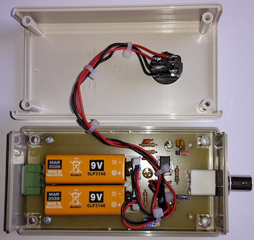
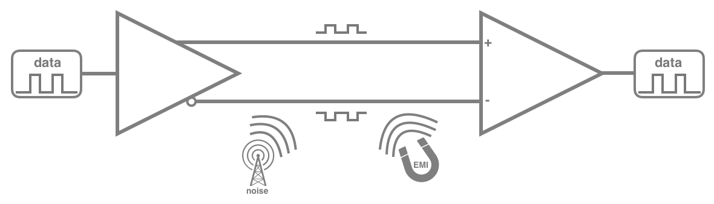
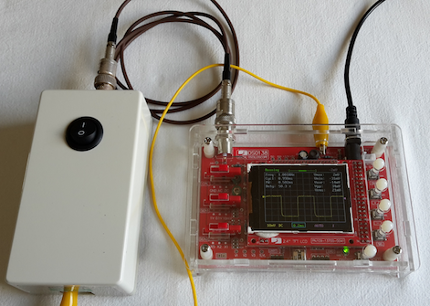

# LabTools : 1MHz Differential Probe

## What

This repository describes how to build your own (first) differential oscilloscope probe. In the respective folders you can find all necessary files to have the pcb produced, drawings on how to prepare the enclosure for final built-in, and detailed datasheets  on the used components.

## Why

Coming soon.............

## How

Coming soon.............

### A differential probe, what is it all about ?

This repository describes how to build your own differential oscilloscope probe. In the respective folders you can find all necessary files to have the pcb produced, drawings on how to prepare the enclosure for final built-in, and detailed datasheets  on the used components.

#### Differential signals

Differential signals are the opposite of [single-ended signals](https://en.wikipedia.org/wiki/Single-ended_signaling). In single-ended signalling technique, the signal is a voltage between the signal line and the ground (which is common between the transmitter and receiver circuitry). A [differential signal](https://en.wikipedia.org/wiki/Differential_signaling) consists of two complementary signals on two wires, which are mirrored around a virtual zero volt axe. At the receiver side, the two signals are subtracted. As any interference on the communication lines will affect either of the lines equally, no more "noise" will be present in the subtracted signal. For that matter it is important for both lines (or wires) to be physically identical, and to follow the same routing. For longer wiring, this usually implies the use of [twisted pair](https://en.wikipedia.org/wiki/Twisted_pair) cables. When applying differential signal paths in PCB's, it might be a good idea, to use the concerning functions which are built in most software packages. In order to obtain a good interference filtering, both (mirrored) complementary signals should cross the virtual zero-line at the exact same moment. For that matter, it is also very important that both signal lines have the exact same length. In electronics, the efficiency of this filtering is referred to as [common-mode rejection ratio](https://en.wikipedia.org/wiki/Common-mode_rejection_ratio).

 

#### Differential probe

Now, why building this accessory for your oscilloscope ?                           
Nowadays, most oscilloscopes do have built-in functionality to subtract the signals between two channels. However, most oscilloscopes unfortunately only have two channels. So when during troubleshooting, you would like to compare the differential signal to anything else in your electronics circuit, a third channel (or second oscilloscope) would be required.

Todo : more info is coming...  

## Progress status

 - [x] have a need to [create something](#why)
 - [x] decide on what it should [do](#input-specifications)
 - [x] design and build a state-of-the-art [prototype](#prototype)
 - [x] [test and validate](#demo-setup-and-measurements) the concept
 - [ ] publish the [schematic and explain the electronics](#electronics)
 - [ ] publish production files for the [electronics board](#printed-circuit-board) board
 - [ ] build a proof-of-concept for the final [electronics](#electronics) and [ housing](#mechanical-construction)
 - [ ] write an [end-user manual](https://github.com/nostradomus/LabTools_1MHz-Differential-Probe/wiki)

## Technical details

### Input specifications

- 1:1 active differential probe
- 1MHz off bandwith
- max 700Vpp (depending on the specifications of R1,R2,C1 and C2)

### Electronics

Coming soon.............

#### Schematics

Coming soon.............

### Printed circuit board

### Building instructions

Coming soon.............

#### Components list

Coming soon.............

#### Demo setup and measurements

...more details concerning the test setup will be added later...

### Mechanical construction

Coming soon.............

### Building instructions

Coming soon.............

## Contributors

If you are having any good suggestions, just drop me a line [:email:](http://nostradomus.ddns.net/contactform.html).
If feasible, I'll be happy to implement proposed improvements.
And if you are having lots of time, I'll be happy to share the work with you ;-).

When you create your own version, don't forget to send us some nice pictures of your construction. We'll be happy to publish them in the :confetti_ball:Hall of Fame:confetti_ball:.

## :globe_with_meridians: License

At this moment, there is no specific license attached to this project yet.

So, today, if you like it, have fun with it (at your own risk of course :-D), and especially, be creative.

Oh, and when using anything from this repository, it is highly appreciated if you mention its origin.

If you would like to use any of this work (or the whole project) for commercial use, first [contact us :email:](http://nostradomus.ddns.net/contactform.html), so we can add the appropriate license, which best fits your business.
